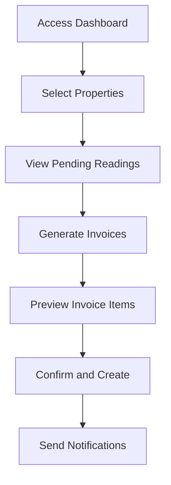
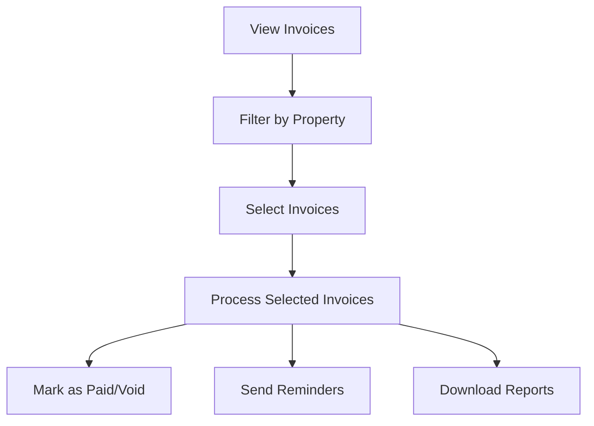

# Multi-Property Invoicing System: Technical Documentation

## Overview

The Multi-Property Invoicing System integrates with the KH Rentals application to provide a comprehensive solution for managing utility billing and invoicing across multiple properties. This document outlines the system architecture, key components, and implementation guidelines.

## Table of Contents

1. [System Architecture](#system-architecture)
2. [Data Model](#data-model)
3. [Service Layer](#service-layer)
4. [UI Components](#ui-components)
5. [User Workflows](#user-workflows)
6. [Property-Rentee Relationship Management](#property-rentee-relationship-management)
7. [Security and Authorization](#security-and-authorization)
8. [Error Handling](#error-handling)
9. [API Documentation](#api-documentation)
10. [Future Enhancements](#future-enhancements)

## System Architecture

```
                    ┌───────────────────┐
                    │    UI Layer       │
                    │  React Components │
                    └─────────┬─────────┘
                              │
                    ┌─────────▼─────────┐
                    │   Context Layer   │
                    │   State & Logic   │
                    └─────────┬─────────┘
                              │
                    ┌─────────▼─────────┐
                    │  Service Layer    │
                    │  API Integration  │
                    └─────────┬─────────┘
                              │
                    ┌─────────▼─────────┐
                    │  Data Storage     │
                    │  Supabase Tables  │
                    └───────────────────┘
```

The system follows a modular architecture that separates concerns between data, business logic, and presentation layers.

## Data Model

### Core Entities

#### Properties
```javascript
{
  id: "uuid",
  name: "string",
  address: "string",
  electricity_rate: "numeric",
  water_rate: "numeric",
  bank_name: "string",
  bank_branch: "string",
  bank_account_number: "string"
}
```

#### Property Units
```javascript
{
  id: "uuid",
  propertyid: "uuid",
  unitnumber: "string",
  floor: "string",
  rentalvalues: "jsonb"
}
```

#### Agreements
```javascript
{
  id: "uuid",
  templateid: "uuid",
  renteeid: "uuid",
  propertyid: "uuid",
  unitid: "uuid",
  status: "string",
  startdate: "date",
  enddate: "date"
}
```

#### Utility Readings
```javascript
{
  id: "uuid",
  renteeid: "uuid",
  propertyid: "uuid",
  utilitytype: "string",
  previousreading: "numeric",
  currentreading: "numeric",
  readingdate: "date",
  status: "string",
  billing_status: "string",
  invoice_id: "uuid"
}
```

#### Invoices
```javascript
{
  id: "uuid",
  renteeid: "uuid",
  propertyid: "uuid",
  billingperiod: "string",
  components: "jsonb",
  totalamount: "numeric",
  status: "string",
  duedate: "date",
  paymentdate: "timestamp",
  paymentproofurl: "string"
}
```

### Relationships

1. **Property to Units**: One-to-many relationship
2. **Property to Agreements**: One-to-many relationship
3. **Rentee to Agreements**: One-to-many relationship
4. **Property to Utility Readings**: One-to-many relationship
5. **Property to Invoices**: One-to-many relationship
6. **Utility Readings to Invoices**: Many-to-one relationship

## Service Layer

### invoiceService.js

The invoice service handles all invoice-related operations with specific functions for multi-property management:

```javascript
/**
 * Fetch utility readings ready for invoicing, grouped by property and rentee
 * @param {Array|string} propertyIds - Property IDs to filter by (array or single ID)
 * @param {Object} options - Additional filter options
 * @returns {Promise<Object>} - Grouped readings with property and rentee info
 */
export const fetchReadingsForInvoiceByProperty = async (propertyIds, options = {}) => {
  // Implementation details
};

/**
 * Generate invoices from utility readings for multiple properties
 * @param {Object} readingsByProperty - Readings grouped by property and rentee
 * @param {Object} options - Additional options for invoice generation
 * @returns {Promise<Object>} - Generated invoices with status
 */
export const generateInvoicesByProperty = async (readingsByProperty, options = {}) => {
  // Implementation details
};

/**
 * Get invoice summary metrics grouped by property
 * @param {Array|string} propertyIds - Property IDs to include (optional)
 * @returns {Promise<Object>} - Summary metrics by property
 */
export const getInvoiceSummaryByProperty = async (propertyIds) => {
  // Implementation details
};
```

### propertyService.js

Extended to support multi-property operations:

```javascript
/**
 * Get properties with pending utility readings ready for invoicing
 * @returns {Promise<Object>} - Properties with pending reading counts
 */
export const getPropertiesWithPendingReadings = async () => {
  // Implementation details
};

/**
 * Get property access information for staff member
 * @param {string} staffId - Staff user ID
 * @returns {Promise<Object>} - Property access details
 */
export const getStaffPropertyAccess = async (staffId) => {
  // Implementation details
};
```

### utilityBillingService.js

Extended to support invoice-related operations:

```javascript
/**
 * Mark utility readings as included in invoice
 * @param {Array} readingIds - Reading IDs to update
 * @param {string} invoiceId - Invoice ID
 * @returns {Promise<Object>} - Result of update operation
 */
export const markReadingsAsInvoiced = async (readingIds, invoiceId) => {
  // Implementation details
};
```

## UI Components

### PropertyContext Provider

```jsx
// src/contexts/PropertyContext.jsx
import React, { createContext, useState, useEffect, useContext } from 'react';

// Context definition and provider implementation
export const PropertyProvider = ({ children }) => {
  // State and methods implementation
};

// Custom hook for using the context
export const useProperty = () => useContext(PropertyContext);
```

### Key Components

1. **PropertySelector**
   - Allows staff to select one or multiple properties
   - Remembers recent selections
   - Supports property search

2. **InvoiceManagementDashboard**
   - Main dashboard for staff to manage invoices
   - Property-grouped invoice summary
   - Action buttons for batch operations

3. **InvoiceGenerationWizard**
   - Step-by-step flow for creating invoices
   - Property grouping for readings
   - Preview and confirmation steps

4. **InvoiceTable**
   - Displays invoices with property context
   - Supports filtering and sorting
   - Action buttons for invoice operations

## User Workflows

### Invoice Generation Workflow



### Invoice Management Workflow



## Property-Rentee Relationship Management

The system carefully maintains the integrity of property-rentee relationships:

1. **Validation Layer**
   - Ensures rentees are associated with properties via agreements
   - Verifies unit assignments within properties
   - Maintains utility reading association with correct property

2. **Invoice Grouping Logic**
   - Groups utility readings by property and rentee
   - Ensures readings for different properties are kept separate
   - Aggregates readings for the same rentee within a property

3. **Data Consistency Checks**
   - Validates that all readings in an invoice belong to the same property-rentee pair
   - Prevents cross-property data mixing
   - Maintains audit trail of property associations

## Security and Authorization

### Staff Property Access Control

```javascript
// Staff user access levels in app_users table
{
  "property_access": {
    "access_type": "limited", // all, group, limited
    "property_ids": ["uuid1", "uuid2"], // Directly accessible properties
    "property_group_ids": ["group1"] // Property groups accessible
  }
}
```

### Authorization Rules

1. Staff can only view and manage properties they have access to
2. Global admin users have access to all properties
3. Property-specific staff can only access assigned properties
4. Property access is enforced at both service and UI levels

## Error Handling

The system implements comprehensive error handling at multiple levels:

1. **Service Layer Errors**
   - Detailed error messages with property context
   - Transaction-based operations to ensure consistency
   - Rollback mechanisms for multi-property operations

2. **UI Error Boundaries**
   - Property-specific error displays
   - Graceful degradation for partial failures
   - Retry mechanisms for failed operations

3. **Error Logging**
   - Property and operation context in logs
   - Structured error data for analysis
   - Alert mechanisms for critical errors

## API Documentation

### Invoice Generation API

```
POST /api/invoices/generate
```

**Request Body:**
```json
{
  "propertyIds": ["uuid1", "uuid2"],
  "billingPeriod": "2023-06",
  "dueDate": "2023-07-15",
  "options": {
    "includeUtilities": true,
    "includeRent": false,
    "sendNotifications": true
  }
}
```

**Response:**
```json
{
  "success": true,
  "data": {
    "invoiceIds": ["uuid1", "uuid2"],
    "propertyResults": {
      "uuid1": {
        "invoiceCount": 5,
        "totalAmount": 25000
      },
      "uuid2": {
        "invoiceCount": 3,
        "totalAmount": 15000
      }
    },
    "errors": []
  }
}
```

### Invoice Query API

```
GET /api/invoices?propertyIds[]=uuid1&propertyIds[]=uuid2&status=pending
```

**Response:**
```json
{
  "data": [
    {
      "id": "uuid1",
      "propertyId": "property1",
      "propertyName": "Downtown Apartments",
      "renteeId": "rentee1",
      "renteeName": "John Doe",
      "amount": 5000,
      "status": "pending",
      "dueDate": "2023-07-15"
    }
  ],
  "pagination": {
    "total": 15,
    "page": 1,
    "pageSize": 10
  }
}
```

## Future Enhancements

1. **Advanced Property Grouping**
   - Logical grouping of properties by location, type, or management structure
   - Custom property groups defined by staff

2. **Multi-Currency Support**
   - Handle properties in different countries with different currencies
   - Automatic currency conversion for reporting

3. **Bulk Payment Processing**
   - Process payments across multiple properties in a single operation
   - Reconciliation tools for batch payments

4. **Property Performance Analytics**
   - Comparative reporting across properties
   - Trend analysis for utility consumption and revenue

5. **API Extensions**
   - Expanded API surface for external system integration
   - Webhook support for property management systems 